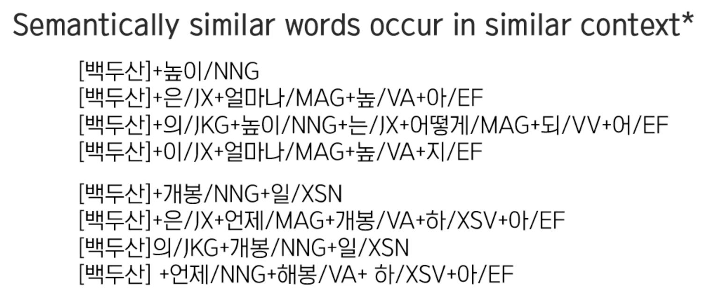
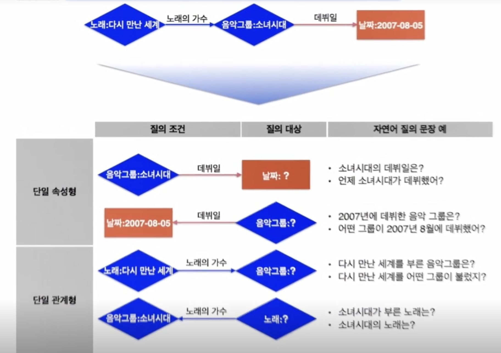

## SKT AI 커리큘럼 - 자연어 이해

자연어 이해(NLU, Natural Language Understanding)는 인간의 언어에서 패턴과 의미를 인식하는 데 중점을 둔 AI 기술입니다.  
기계는 자연어 이해를 통해 화자의 말 뿐만 아니라 실제로 의미하는 바를 추론할 수 있습니다.  

이를 통해 사전 입력된 표현을 사용하지 않아도 자연스럽게 대화를 나누는 것처럼 작동합니다.  

  

  

  

## 1강 자연어 이해 기술이란?

### 자연어 이해 기술 : 기계가 사람의 말을 이해할 수 있도록 하는 기술

  

  

  

###  자연어 이해 기술의 목적 : 가장 인간 같은 기계 

튜링테스트

  

둘 중 누가 진짜 여성인지를 맞추는 것

  

→ 

  

기계를 여성이라고 답하면, 그 기계는 인공지능

  

  

튜링테스트 통과 + 발전 중인 챗봇

  

  

  

  

  

  

  

  

  

### 사람이 하는 말로 기계의 도움을 받을 수 있을까?

  

  

  

응용사례

  

  

  

  

자연어 인터페이스의 대표적인 사용처는 ai 스피커

### 가상 개인 비서의 할 일

  

- 원하는 일을 해줌
- 무엇을 말하는 것인지 이해하고 서비스 제공
- 개인적인 정보를 알고, 그 사람이 아는 선에서 서비스 제공

  

  

### 요약 

  

  

  

## 2강 자연어의 특징

### 자연어 분석 단계

  

  

- 구문론 

  

동일한 의미이나 구조가 다름.

  

  

- 의미론

  

  

 문장의 구조가 같으나 의미가 다름   

넓이를 다루는 ‘커' : 높이를 다루는 ‘커'

  

  

  

이 세 가지가 모두 같은 의미표현임을 정규화.

  

의미론 측에서는 적합, 화용론 측면에서는 부족.

- 화용론

  

  

  

1. 노래 목록을 열람하는 중 다음 노래에 커서가 가도록 함.
2. 노래 재생 중 다음 플레이리스트 곡을 재생하도록 함.

  

  

  

### 합성성

  

  

  

### 비합성성

  

  

  

### 생략

  

  

  

### Challenge : 모호성, 불확실성

  

  

### 요약

  

  

  

## 3강 의미 이해 방법 Semantics

### Distributional semantics

  

백두산 → mountain으로 인식

  

→ ‘백두산’ 이라는 영화가 나왔을 경우

  

백두산 → mountain/film으로 인식

이러한 경우 구분을 해야 한다.

  

  

 

백두산이 산으로 쓰이는 경우, 백두산이 영화제목으로 쓰이는 경우

  

  

  

모호성이 없는 경우

  

  

  

  

  

  

  

  

  

  

###  분류와 문맥 단어 간의 맥트릭스를 기계에 전달

  

  

‘높이가 몇 미터지'를 벡터로 변환한 다음 cos 유사도 검사 진행. mountain과 더 유사함을 확인하고 mountain으로 분류.

  

  

  

  

  

### 단어 간 거리 시각화 (FastText)

  

‘공유’ 라는 단어는 영화말고도 많이 쓰여서 분리된 거로 보임.

  

  

배우와 영화 캐릭터간의 구분  

  

  

  

기계가 사람의 말을 이해하기에 충분한가?

  

Distributional semantics를 통해 백두산 단어 하나를 이해했지만 전체 문장을 이해하는 데에는 부족. ‘높이'와 같이 전체 문장을 이해하는 방법.

  

\->

### Frame semantics

정형적인 상황을 표현하는 프레임으로 의미를 표현 

  

  

  

Semantic role labeling : 평서문을 대상으로 함. 문장을 분석했을 때, 문장에 나오는 어떤 대상의 entity와 값이 있을 때, 그 값이 어떤 관계를 갖는 지를 labeling한다.

→ height : 백두산과 2750m를 이어주는 의미.

  

  

  

  

  

  

  

‘가장', ‘보다 높은’ 합성성을 지닌 문장의 경우

  

→

  

### Formal semantics

Language as programs. 문장을 프로그램으로 봄. 그리고 그 프로그램을 찾음.

  

  

 

semantic parsing   

  

  

  

합성성의 특성을 활용해서 분석.

  

  

  

딥러닝 분야의 활용.

  

  

### 요약

  

  

  

  

## 4강 자연어 이해(NLU) 기술 상용화 이해

  

  

  

  

### Frame semantics기반의 상용 자연어 이해 기술

  

  

  

  

  

  

### 도메인 분류

NUGU의 서비스 도메인 확장

  

  

  

도메인은 결국 분류의 문제.

  

  

입력된 문장을 분류하기 위해서 feature을 정리.

  

1\. BOW

원래 있던 문장에서 가방안의 단어 뭉치로 치환. → 정보 손실 발생: 순서 정보가 날라간 단어의 집합이 됨.  

단어의 빈도수 체크

  

  

2\. N-grams

선우 관계(순서 정보)손실을 막는 방법. 

  

unigram : 단일 단어

bigram : 두 연속 단어

trigram : 세 연속 단어

  

  

  

가장 적합한 분류기 선택

→ 성능, 속도, 오분석 고치기 (딥러닝을 포함한 기계학습 모델은 오분석 고치기가 힘들다. 올바른 데이터를 더 집어넣어서 학습시켜야 함. 반대로 규칙기반은 수정에 용이)

  

### 개체명 인식

  

  

  

첫 번째로 사전의 관점

  

사전은 기존 사전 db를 가지고 있는 업체와 계약. → 정제 작업도 필요.

사전만으로는 충분하지 않다. 아직 정의되지 않은 단어도 있다.

  

  

두 번째로 Distributional semantics의 관점

  

Q2-2 : 문장이 아니라, 노래제목만 덩그러니 들어오는 경우. 

  

  

  

  

  

개체명을 찾는 방법 : 문장에서 해당 entity를 표시해주는 tag를 붙임.

BIO Tagging

B: 시작단어

I : B-tag 다음에 오는 단어

O : entity에 해당하지 않음.

  

  

  

### 의도 식별

  

문장에 드러나는 패턴을 분석해서 규칙으로 품.  

  

  

  

  

  

1. 개체명이 의도 식별에 도움이 된다.
2. 조사나 어미에 의해 다양하게 표현이 되는 경우가 있다. 

  

  

### 도메인 NLU 모델 설계

  

1. A안 : 전부다 intent로 표현
2. B안 : entity로 기기를 잡음
3. C안 : 각 기기를 entity에서도 표현

  

B안이 좀 더 General하게 쓰기 좋아 보인다.

  

  

  

처음에 받은 요구에만 딱 맞게 모델링하기 보다는, 향후 어떤 요청이 들어올지 고민을 하면서 모델링을 해야 한다.

  

  

## 5강 NLU 상용화 주요 이슈

  

### 주요 이슈 : Noise

  

띄어쓰기 생략 (형태소 분석에 오류), 

영어(한국어)표기일 경우 사전에 등록되어 있지 않을 수도 있다. 

  

대안 → 

음성인식 기술 향상.

사전이 빠르게 대응하여 한/영 표기 모두 등록

  

### 주요 이슈 : Ambiguity

  

‘아이유 찾아줘'만 듣고 셋 중에서 판단을 할 수 있는가? 사실 사람도 판단하기 어렵다.

  

→ 디바이스 정보를 보는 것도 하나의 방법.

어떤 기계를 사용 중인 상태에서 불렀는지, 어떤 프로그램을 사용 중인 상태에서 불렀는지.

  

단순히 문장정보로는 해결하기 어렵다.

  

  

### 주요 이슈 : Data

  

사용자의 의도가 담긴 발화 패턴이 기계가 예상하는 발화 패턴과 다른 경우

ex) ‘노래 틀어줘’라고 나는 흔히 말하는데, 서비스는 ‘음악 틀어줘'일 경우만 작동.  || 사투리 사용

→ 테스트를 하면서 다양한 표현을 찾는 게 답.

  

  

  

### 주요 이슈 : Rejection

컴퓨터는 빠르게 ‘나는 이걸 몰라'라고 말하는 것을 잘 못한다.

모르는 것을 물으면 계속 찾기에 오래 걸린다.

→ 서비스 대상으로 삼지 않는 것을 아니라고 이야기 하기가 어렵다.

시스템이 서비스대상으로 하는 영역과 실제 시스템 출력은 다를 수 있다. 

  

사용자 발화와 서비스 대상발화가 아님에도 시스템이 정상적으로 reject하지 못하고 정상 분석 하는 경우가 문제이다.

아마 이 영역이 꽤 클 것으로 보인다. 

→ 아마 많은 서비스가 NLU는 정상출력이라고 보지만, 시스템이 서비스 불가능한 영역이라서 불가능하다고 표현할 것으로 본다.

  

  

  

## 6강 NLU 서비스 고도화 사례

  

### semantic parsing

  

현재 누구백과 서비스는 속성값을 기준으로하는 질문을 받지는 않음. → 되면 좋을 듯

응답 컨텐츠를 어떻게 보여줄 지도 고민을 해야 함. ex) 스피커로 김치찌개 만드는 방법을 어떻게 보여주나

  

  

  

KB : knowledge base 잘 정제된 데이터베이스

  

+) 여담 : 사람들이 ai에 많이 묻는 정보로 ‘생일'이 있다. 다른 사람의 신상정보에 관심이 많은 듯 하다.

  

  

  

  

KB를 통해서 만들 수 있는 질문이 너무 방대해서, 이 중에서 어떤 질문 유형에 집중해서 개발할지 정할 필요가 있었음. 그래서 조사를 함.

  

  

1. 객체명 인식
2. 분류문제
3. 객체와 분류를 align 

  

  

  

  

  

  

주어진 kb를 이용해서 답을 할 수 있는 formal query template을 제작. template 자체는 일반인이 보기에 이해하기 어려우므로, 일반인이 이해하기 쉽도록 자연어 Paraphrasing(문장과 동일한 의미에 다른 표현을 만듦)한다.  

데이터 구축 → 엔진 생성

  

  

  

데이터 구축을 통해 만들어진 엔진이 잘 분석하는 지 테스트. 

1. n-best 출력을 테스터에게 보임.
2. 정답일 경우 마킹.

  

  

  

  

  

  

  

  

  

1. 객체명 인식
2. DCS(formal한 query를 표현하는 language)를 활용한 chart parsing. formal query language의 후보군 만들기.
3. 그 결과를 입력을해서 ranking을 함. (머신러닝 방법론 적용)

  

  

  

  

규칙 1. 사전 : 각 단어를 사전에 따라 분류

규칙 2. 결합 : 결합이 가능한 타입끼리 결합. (REL-LOC은 COUNTRY라는 entity타입과 결합할 수 있다는 결합규칙이 필요)

unary : 표현 자체가 category에 해당한다는 의미. (REL-TYPE(산) = 그 카테고리 이름이 산)

  

  

‘에서’가 REL-ROC이 아닐 수도 있다.

‘백두산’이 영화 분류일 수도 있다.

‘보다 높은'이 높이(PRO=HEIGHT 말고 다르게 쓰일 수도 있다.

이렇듯 chart parsing을 통해서 formal 표현( “ (more(and (REL-TYPE .... ) “ ) 을 여러 개 만들 수 있는데, 이 중에서 가장 적합한 것을 찾는 것이 ‘Ranking’ 과정에서 이루어진다.

  

  

KB의 모습 (잘 정리된 데이터베이스, 개념-개념간의 관계-속성으로 정의)

  

  

어떤 것들이 표현되어 있는 지 정의하는 것을 ‘스키마’라고 함.

  

  

  

  

  

  

  

 

  

  

  

  

### 단일 조건 질의문

  

  

  

  

  

  

  

  

  

chart parsing을 통해서 parsing된 결과.

  

  

  

많은 후보군을 Ranking함.

Ranking 자질(feature)에 대한 weight 정보를 보여줌.

  

  

### 복합 조건 질의문

  

  

  

### 통합 도메인 (음악의 도메인과 TV의 도메인을 연결하기) : entity linking

  

tv도메인에서 소녀시대 소속 멤버를 찾으면 엉뚱한 대답을 한다.

  

원인:

  

  

  

해결: same as로 엮기

db는 다르지만 같은 entity로 연결.

  

  

  

  

  

  

결과:

  

소녀시대 소속 멤버 - 음악db

방송 - tv

  

  

### Rejection

Rejection은 NLU 사용 접근에서 어려운 문제 중 하나.

  

  

Rejection은 도메인 분류 단계에서 할 수 있다.
