## SKT AI 커리큘럼 레포트

SKT AI Curriculum 중 듣고싶은 강좌를 총 75분 이상 수강하고, 레포트 총 3장으로 한글로 작성하여 제출 (폰트 10 기준, 그림 포함)- 수기 워드 한글 ppt 모두 상관없음  

* * *

  
 자연어 이해 기술(Natural Language Understanding)은 인간의 언어에서 패턴과 의미를 인식하는데 중점을 둔 인공지능 기술이다. 기계는 자연어 이해를 통해 화자의 말 뿐만 아니라 그 의도를 추론할 수 있다. 이를 통해서 사전 입력된 표현을 사용하지 않아도 자연스럽게 대화를 나누는 것처럼 작동한다.

 자연어 이해 기술의 목적은 가장 인간 같은 기계를 만드는 것이었다. 그 예시로  Imitation Game - Turing test가 있다. 사람을 잘 연기하고 사람과 유사한 대화를 해내는 튜링 기계를 만들고자 하였다. 그리고 실제로 사람처럼 대화를 이어나가고 구체적인 답변을 만들어내는 AI 챗봇이 연구되고 있다. 

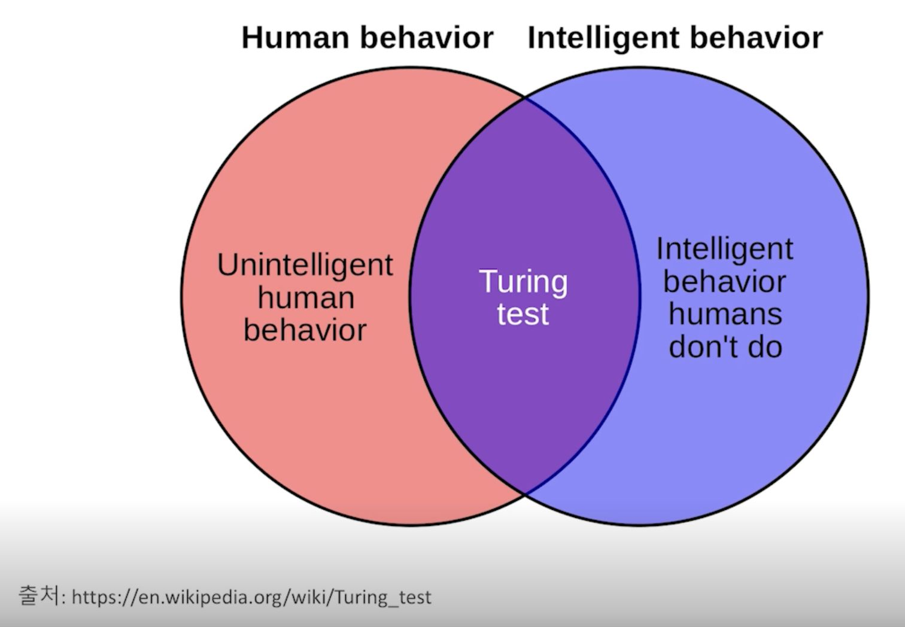 

튜링기계는 intelligent human behavior을 모방하는 데에 초점을 두고 있다. 그렇기에 사람다운 기계를 만드는 것에 중심을 두고 있었다. 여기에 더 나아가서 Intelligent behavior humans don’t do 영역의 일들을 기계에게 맡기면 어떨 지에 대한 의견이 나왔고, 자연어 이해 기술은 이 분야로 연구를 확장한다. 그 대표적인 사례는 ‘인공지능 스피커’와 ‘질의 응답 시스템’이다.

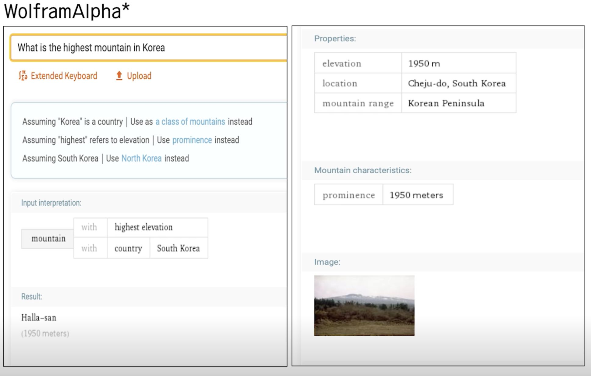  

  

사용자가 기계에게 자연어로 요청을 한다. 기계는 사용자가 무엇을 말하는 지 의미를 이해하고 서비스를 제공한다.

 자연어는 세 가지 분석 단계를 거친다. 첫 번째는 구문론이다. 형태소 단위로 문장의 구조를 나눈다. 두 번째는 의미론이다. ‘한국은 얼마나 커’와 ‘백두산은 얼마나 커’는 동일한 문장 구조를 이루지만 의미가 다르다. ‘한국’ -  ‘커’는 넓이를 다루는 의미이고, ‘백두산’-’커’는 높이를 다루는 의미이다. 그래서 특정 도메인에 대한 지식으로 의미사전을 구성하고, 상황에 맞게 적절한 의미를 적용한다. 세 번째는 화용론이다. ‘다음 노래’라는 입력을 받았을 때 ‘select.music.next’ 또는 ‘play.music.next’로 분석할 수 있다. 전자는 노래 목록을 열람하는 중 다음 노래에 커서가 가도록 하는 것이고, 후자는 노래 재생 중 다음 플레이리스트 곡을 재생하도록 하는 것이다. 대화 상황에 대해 이해하고 화자의 진짜 의도를 파악한다. 이러한 분석 단계에서 자연어 이해는 두 가지 challenges를 맞닥뜨린다. 바로 ambiguity와 uncertainty이다. 아이유가 ‘부른’ 노래와 아이유가 ‘작곡한’ 노래사이에는 ambiguity가 발생한다. 아이유가 작곡한 노래를 정말 찾아주더라도, 사용자가 원하는 건 사실 아이유가 부른 노래였을 경우 좋지 못한 사용경험을 심어줄 수 있어 고민해봐야 한다. 올해 ‘흥행한’ 영화와 올해 ‘망한’ 영화를 찾아달라는 요청을 받았을 때, 흥망의 기준 중 모든 사용자가 인정할만한 객관적 기준이 존재하지 않기 때문에 uncertainty가 발생한다.

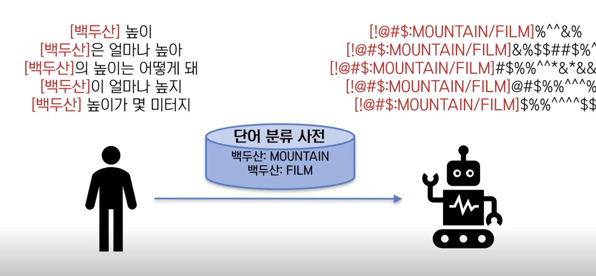

 위의 사진을 보면 기계가 ‘백두산’이라는 말을 듣고 \[MOUNTAIN/FILM\]으로 카테고리를 나눈 것을 알 수 있다. 백두산은 산의 이름이기도 하지만 영화의 제목이기도 하다. 그렇기에 두 가지로 분류될 수 있고, 여기에서 ambiguity가 발생한다. 이러한 경우 구분을 해야 한다. 이러한 과정을 Distributional semantics라고 한다.

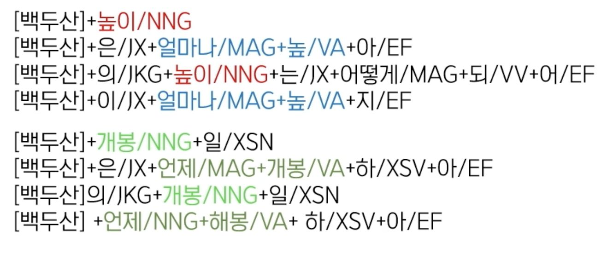  

구분을 위해서 먼저, ‘백두산이 산으로 쓰이는 경우, 백두산이 영화제목으로 쓰이는 경우’의 문장을 가져온다.

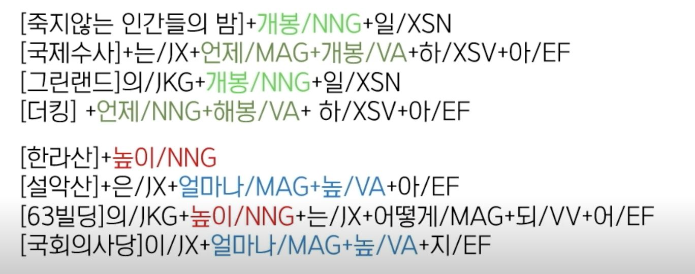  

그리고 ambiguity가 없는 유사 카테고리의 단어들이 쓰이는 문장을 가져온다.

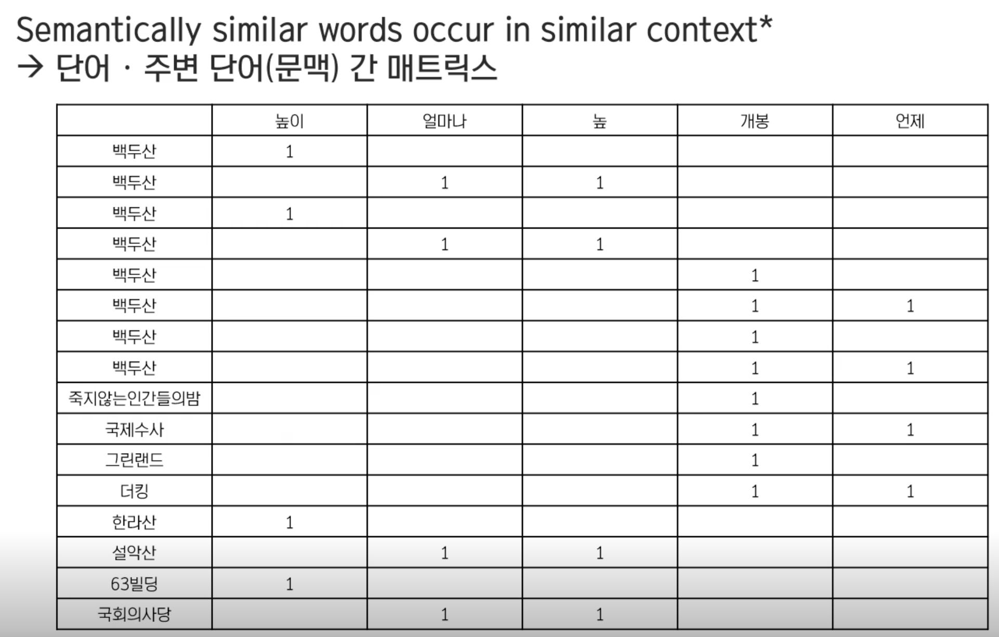  

  

그리고 분류와 문맥 단어 간의 매트릭스로 만든다.

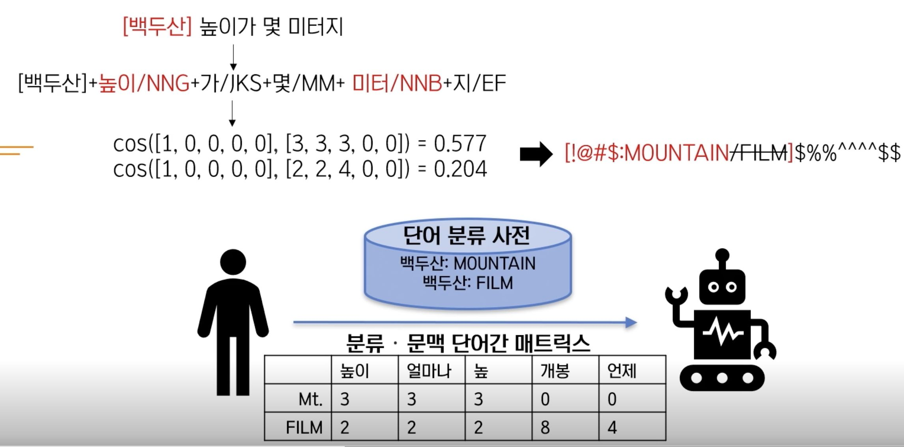  

매트릭스를 기계에 전달한다. ‘높이가 몇 미터지'라는 문장을 벡터로 변환한 다음 cos 유사도 검사 진행한다. MOUNTAIN 카테고리와 더 유사함을 확인하고 MOUNTAIN으로 분류함으로써 ambiguity문제를 해결한다. Distributional semantics를 통해 ‘백두산’이라는 단어를 분석했지만, 그 이후의 ‘높이’, ‘미터’와 같이 전체 문장을 이해하는 방법론도 필요하다. 이때는 Frame semantics를 사용한다. 정형적인 상황을 표현하는 프레임으로 의미를 표현한다.

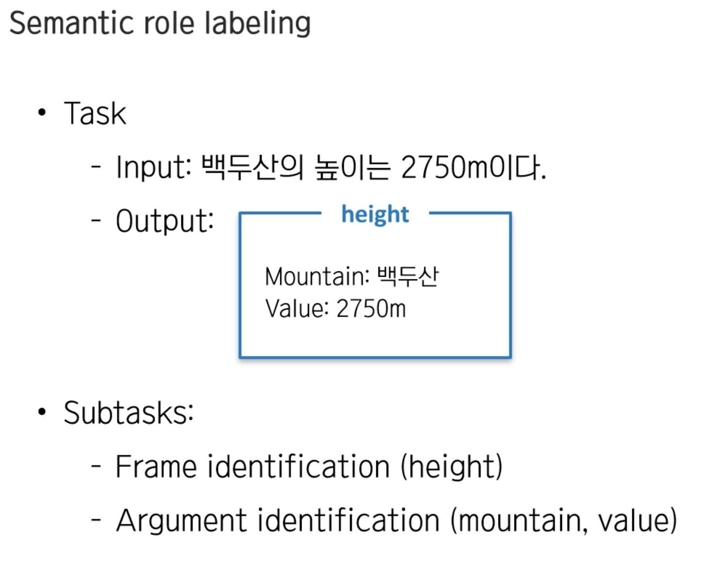  

semantic role labeling을 사용하는데, 문장에 나오는 어떤 대상의 entity와 값이 있을 때, 그 값이 어떤 관계를 갖는 지를 labeling한다. 위에서는 height가 백두산과 2750m를 이어주는 의미를 갖는다. 만약 ‘가장 ~한’, ‘~보다 더’와 같이 합성성을 지닌 문장의 경우에는 Formal semantics를 사용한다. 

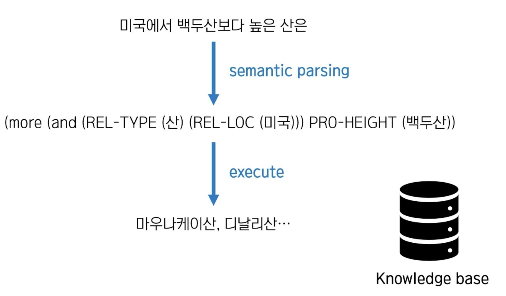  

KB를 통해 문장을 semantic parsing하고, 조건에 부합하는 답을 찾는다.

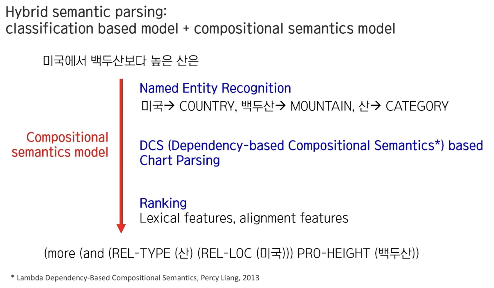  

semantic parsing은 세 단계로 진행되는데, 첫 번째는 객체명 인식이다. 두 번째는 DCS를 활용하여 chart parsing, formal query language의 후보군을 만든다. DCS는 formal한 query를 표현하는 language이다. 세 번째는 DCS 후보군을 입력 받은 후 머신러닝 방법론을 이용해서 Ranking을 메긴다.

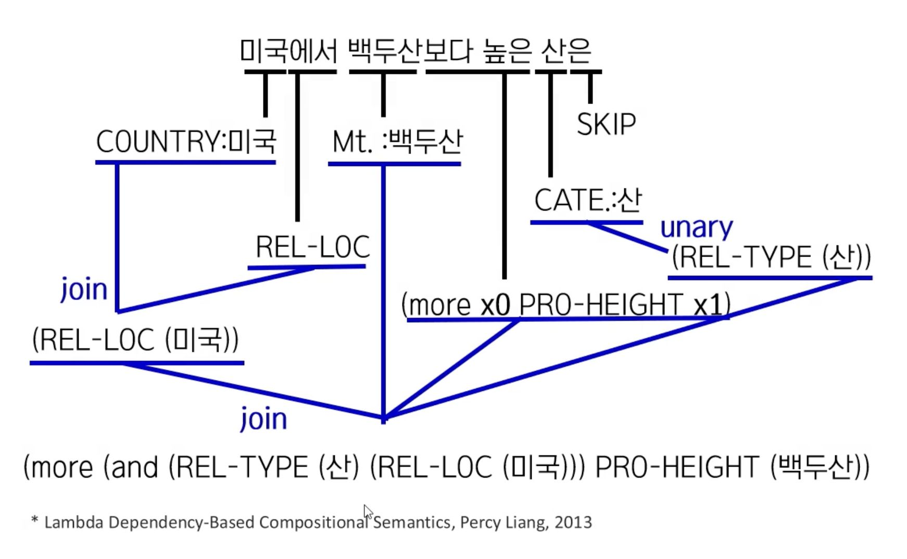  

첫 번째로 각 단어를 사전에 따라 분류한다. 두 번째로 결합이 가능한 타입끼리 결합한다. 위의 그림에서 REL-LOC은 COUNTRY라는 entity타입과 결합할 수 있다는 결합 규칙이 존재해서 join을 하였다. ‘unary’는 표현 자체가 category에 해당한다는 의미이다 REL-TYPE(산)일 경우 그 카테고리 이름이 산이라는 뜻이다. 다만, ‘에서’가 REL-ROC이 아닐 수도 있다. ‘백두산’이 영화 분류일 수도 있다. ‘보다 높은'이 높이(PRO=HEIGHT 말고 다르게 쓰일 수도 있다. 이렇듯 chart parsing을 통해서 formal 표현( “ (more(and (REL-TYPE .... ) “ ) 을 여러 개 만들 수 있는데, 이 중에서 가장 적합한 것을 찾는 것이 ‘Ranking’ 과정에서 이루어진다.

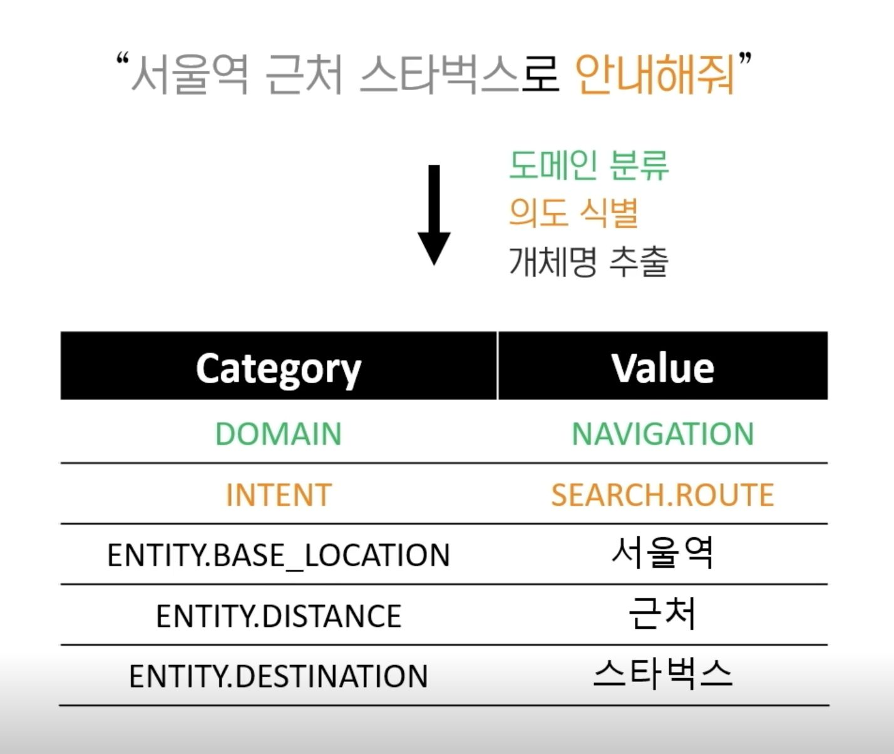  

 Frame sematics기반으로 자연어를 이해하기 위해 도메인 분류, 개체명 추출, 의도 식별의 과정을 거친다.

  

‘신과 함께’는 웹툰, 영화, 영화OST나 곡명, 심지어 팟캐스트까지 다양한 의미로 쓰일 수 있다. 그렇기에 도메인을 분류한 다음 옳은 도메인을 선택해야 한다. 입력된 문장을 분류하기 위해서 feature을 정리한다.

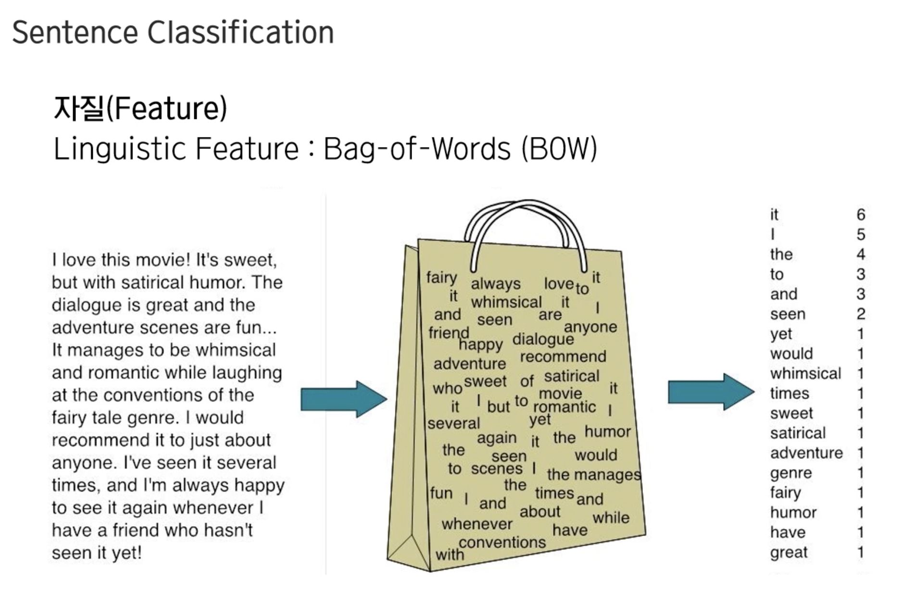  

첫 번째 방법은 BOW(Bags-of-Words)이다. 원래 있던 문장을 전부 쪼갠 후 가방에 넣는다. 그리고 단어의 빈도수를 체크한다. 다만, 정보 손실이 발생한다. 문장의 순서 정보가 날라간 단어의 집합이 된다.

  

두 번째 방법은 N-grams이다. BOW와는 다르게 선우 관계(순서 정보)손실을 막는 방법이다. unigram은 단일 단어, bigram은 두 개가 연속되는 단어. trigram 은 세 개 연속되는 단어를 의미한다.

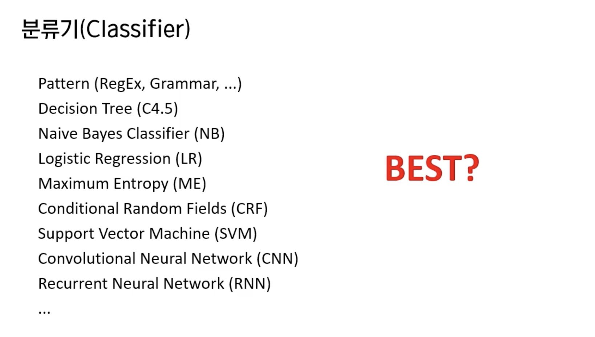  

feature을 분류해주는 방법론들을 어떤 분류기에 적용시켜서 적용할 지는 프로그래머에게 달려있다. 가장 적합한 분류기 선택할 필요가 있는데, 성능, 속도, 오분석 수정과 같이 다양한 기준을 가지고 가장 적합한 분류기를 선택해야 한다. 예를 들면, 딥러닝을 포함한 기계학습 모델은 오분석 고치기가 힘들다. 올바른 데이터를 더 집어넣어서 학습시켜야 한다. 반대로 규칙기반은 오분석 수정에 용이하다. 도메인 분류 이후에 개체명 추출을 한다.

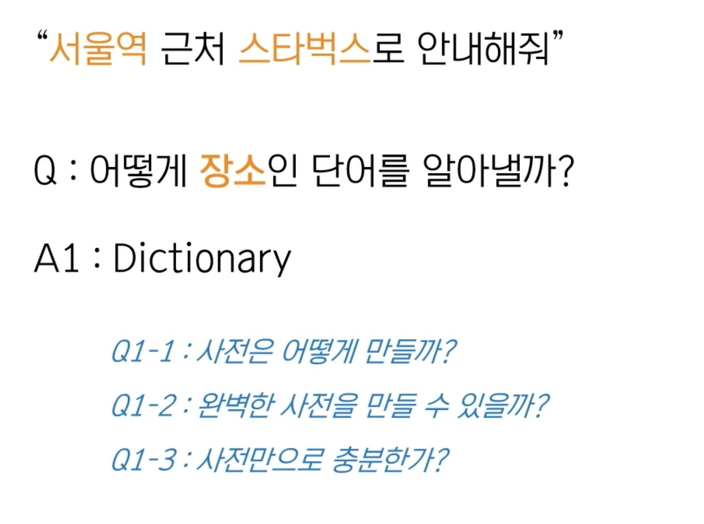  

사전의 관점으로 개체명을 추출할 수 있다. 사전은 기존 사전 db를 가지고 있는 업체와 계약하여 활용한다. 다만 사정정보를 프로그램이 읽을 수 있도록 하는 정제 작업이 필요하다. 물론 사전만으로는 충분하지 않다. 아직 정의되지 않은 단어도 있기 때문이다.

  

두 번째로 Distributional semantics의 관점으로 개체명을 추출할 수 있다. 다만, 사용자가 주변 단어가 포함되지 않은 텍스트를 입력할 수 있다. 음악 검색의 경우 작곡가나 주변 정보 없이 노래제목만 덩그러니 들어오는 경우에, 그 제목이 동일한 곡명이 많은 경우 문제가 발생한다.

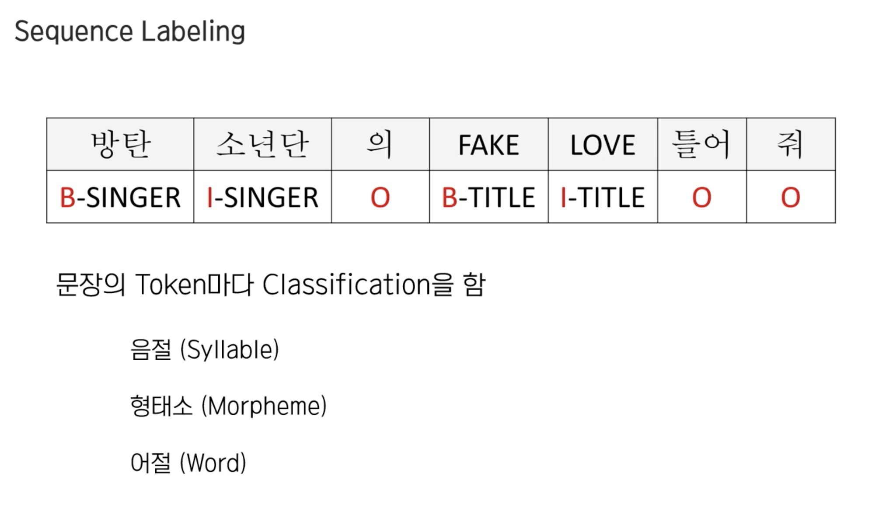  

개체명을 분류한 후, 해당 entity를 표시해주는 tag를 붙인다. BIO Tagging 방식으로, B는 시작 단어, I는 B-tag 다음에 오는 단어, O는 entity에 ‘해당하지 않음’을 의미한다. 개체명 추출 후 의도 식별을 진행한다.

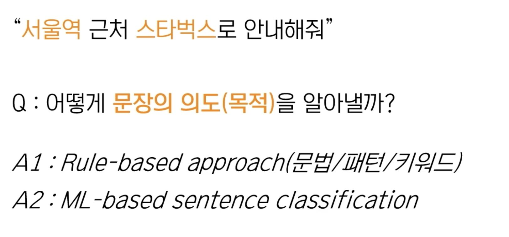  

의도를 파악하기 위해서, 문장에 드러나는 패턴을 머신러닝 방법론을 이용해서 분석한 후 규칙으로 설정하고 의도를 읽어낸다. intent와 개체명(entity)를 분류한 후 상용화를 위한 도메인 NLU 모델을 설계한다. 이때 문장의 요소들에 대해 어떤 것을 intent로 설정할지, entity로 설정할지 정해야 한다.

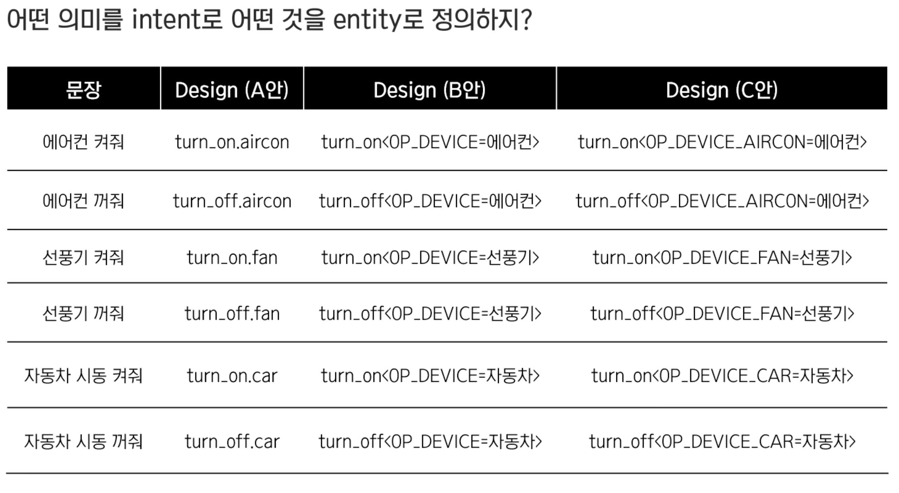A안은 전부다 intent로 표현하였다. B안은 기기를 entity로 설정했다. C안은 각 기기를 entity에서도 표현하였다.  B안이 좀 더 General하게 쓰기 좋아 보인다.

  

왜냐하면 시스템 출시 이후에 새로운 기기 목록이 업데이트 되거나 동작이 추가될 수 있기 때문이다. 처음에 받은 요구에만 딱 맞게 모델링하기 보다는, 향후 어떤 요청이 들어올지 고민을 하면서 모델링을 해야 한다.