## SKT AI 커리큘럼 레포트

SKT AI Curriculum 중 듣고싶은 강좌를 총 75분 이상 수강하고, 레포트 총 3장으로 한글로 작성하여 제출 (폰트 10 기준, 그림 포함)- 수기 워드 한글 ppt 모두 상관없음  

* * *

  
 자연어 이해 기술(Natural Language Understanding)는 인간의 언어에서 패턴과 의미를 인식하는데 중점을 둔 인공지능 기술이다. 기계는 자연어 이해를 통해 화자의 말 뿐만 아니라 그 의도를 추론할 수 있다. 이를 통해서 사전 입력된 표현을 사용하지 않아도 자연스럽게 대화를 나누는 것처럼 작동한다.

 자연어 이해 기술의 목적은 가장 인간 같은 기계를 만드는 것이었다. 그 예시로  Imitation Game - Turing test가 있다. 사람을 잘 연기하고 사람과 유사한 대화를 해내는 튜링 기계를 만들고자 하였다. 그리고 실제로 사람처럼 대화를 이어나가고 구체적인 답변을 만들어내는 AI 챗봇이 연구되고 있다. 

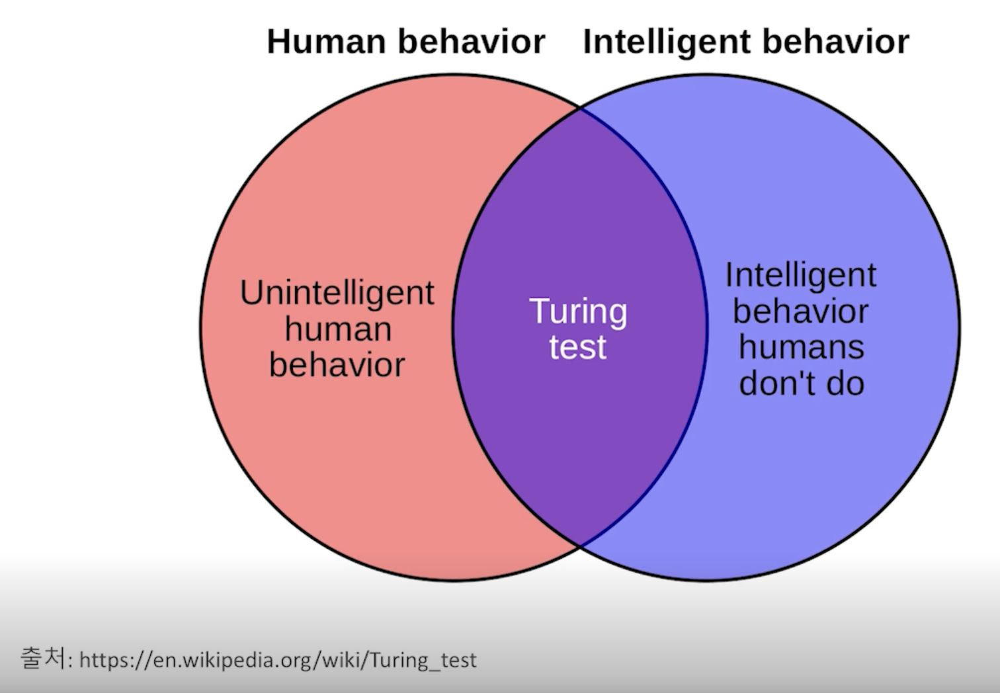 

튜링기계는 intelligent human behavior을 모방하는 데에 초점을 두고 있다. 그렇기에 사람다운 기계를 만드는 것에 중심을 두고 있었다. 여기에 더 나아가서 Intelligent behavior humans don’t do 영역의 일들을 기계에게 맡기면 어떨 지에 대한 의견이 나왔고, 자연어 이해 기술은 이 분야로 연구를 확장한다. 그 대표적인 사례는 ‘인공지능 스피커’와 ‘질의 응답 시스템’이다.

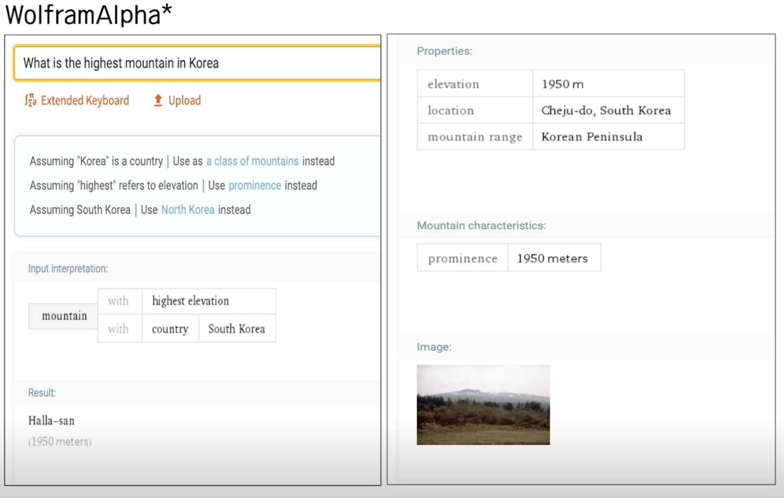  

  

사용자가 기계에게 자연어로 요청을 한다. 기계는 사용자가 무엇을 말하는 지 의미를 이해하고 서비스를 제공한다.

 자연어는 세 가지 분석 단계를 거친다. 첫 번째는 구문론이다. 형태소 단위로 문장의 구조를 나눈다. 두 번째는 의미론이다. ‘한국은 얼마나 커’와 ‘백두산은 얼마나 커’는 동일한 문장 구조를 이루지만 의미가 다르다. ‘한국’ -  ‘커’는 넓이를 다루는 의미이고, ‘백두산’-’커’는 높이를 다루는 의미이다. 그래서 특정 도메인에 대한 지식으로 의미사전을 구성하고, 상황에 맞게 적절한 의미를 적용한다. 세 번째는 화용론이다. ‘다음 노래’라는 입력을 받았을 때 ‘select.music.next’ 또는 ‘play.music.next’로 분석할 수 있다. 전자는 노래 목록을 열람하는 중 다음 노래에 커서가 가도록 하는 것이고, 후자는 노래 재생 중 다음 플레이리스트 곡을 재생하도록 하는 것이다. 대화 상황에 대해 이해하고 화자의 진짜 의도를 파악한다. 이러한 분석 단계에서 자연어 이해는 두 가지 challenges를 맞닥뜨린다. 바로 ambiguity와 uncertainty이다. 아이유가 ‘부른’ 노래와 아이유가 ‘작곡한’ 노래사이에는 ambiguity가 발생한다. 아이유가 작곡한 노래를 정말 찾아주더라도, 사용자가 원하는 건 사실 아이유가 부른 노래였을 경우 좋지 못한 사용경험을 심어줄 수 있어 고민해봐야 한다. 올해 ‘흥행한’ 영화와 올해 ‘망한’ 영화를 찾아달라는 요청을 받았을 때, 흥망의 기준 중 모든 사용자가 인정할만한 객관적 기준이 존재하지 않기 때문에 uncertainty가 발생한다.

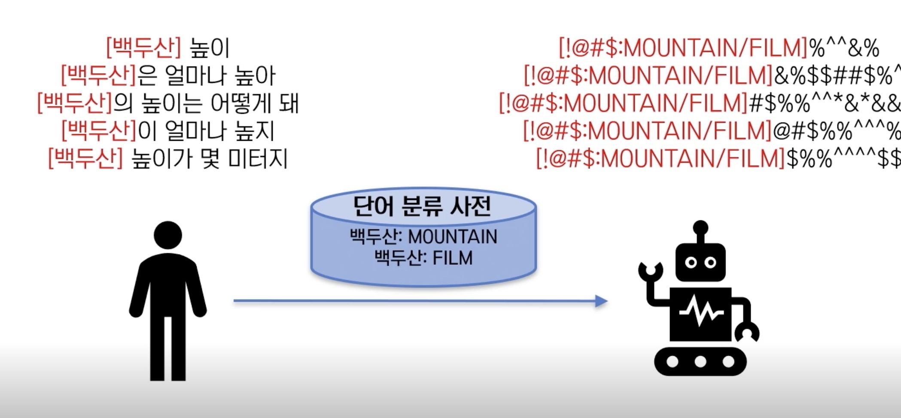

 위의 사진을 보면 기계가 ‘백두산’이라는 말을 듣고 \[MOUNTAIN/FILM\]으로 카테고리를 나눈 것을 알 수 있다. 백두산은 산의 이름이기도 하지만 영화의 제목이기도 하다. 그렇기에 두 가지로 분류될 수 있고, 여기에서 ambiguity가 발생한다. 이러한 경우 구분을 해야 한다. 이러한 과정을 Distributional semantics라고 한다.

  

구분을 위해서 먼저, ‘백두산이 산으로 쓰이는 경우, 백두산이 영화제목으로 쓰이는 경우’의 문장을 가져온다.

  

그리고 ambiguity가 없는 유사 카테고리의 단어들이 쓰이는 문장을 가져온다.

  

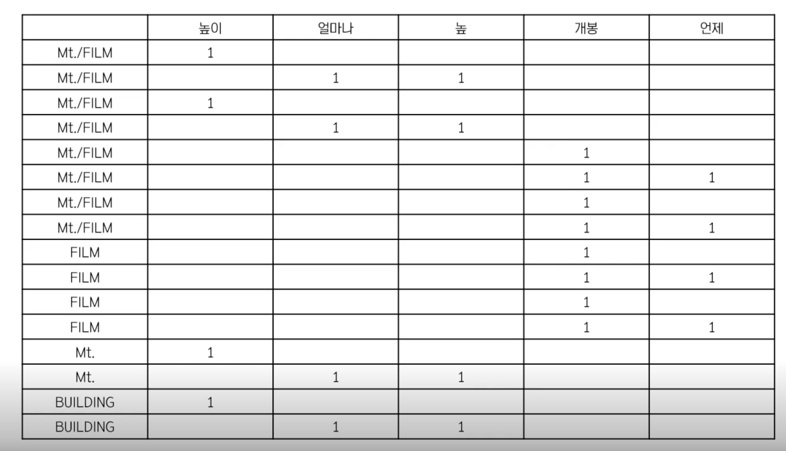  

그리고 분류와 문맥 단어 간의 매트릭스로 만든다.

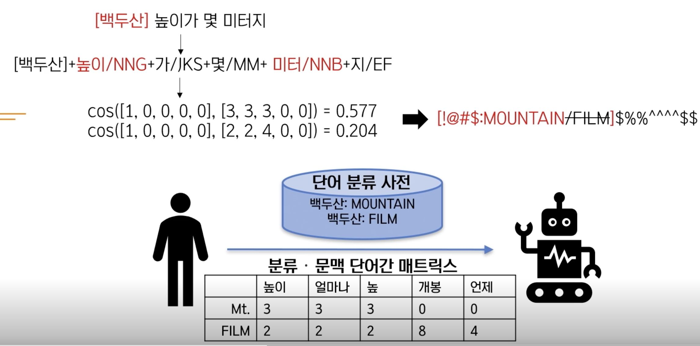  

매트릭스를 기계에 전달한다. ‘높이가 몇 미터지'라는 문장을 벡터로 변환한 다음 cos 유사도 검사 진행한다. MOUNTAIN 카테고리와 더 유사함을 확인하고 MOUNTAIN으로 분류함으로써 ambiguity문제를 해결한다. Distributional semantics를 통해 ‘백두산’이라는 단어를 분석했지만, 그 이후의 ‘높이’, ‘미터’와 같이 전체 문장을 이해하는 방법론도 필요하다. 이때는 Frame semantics를 사용한다. 정형적인 상황을 표현하는 프레임으로 의미를 표현한다.

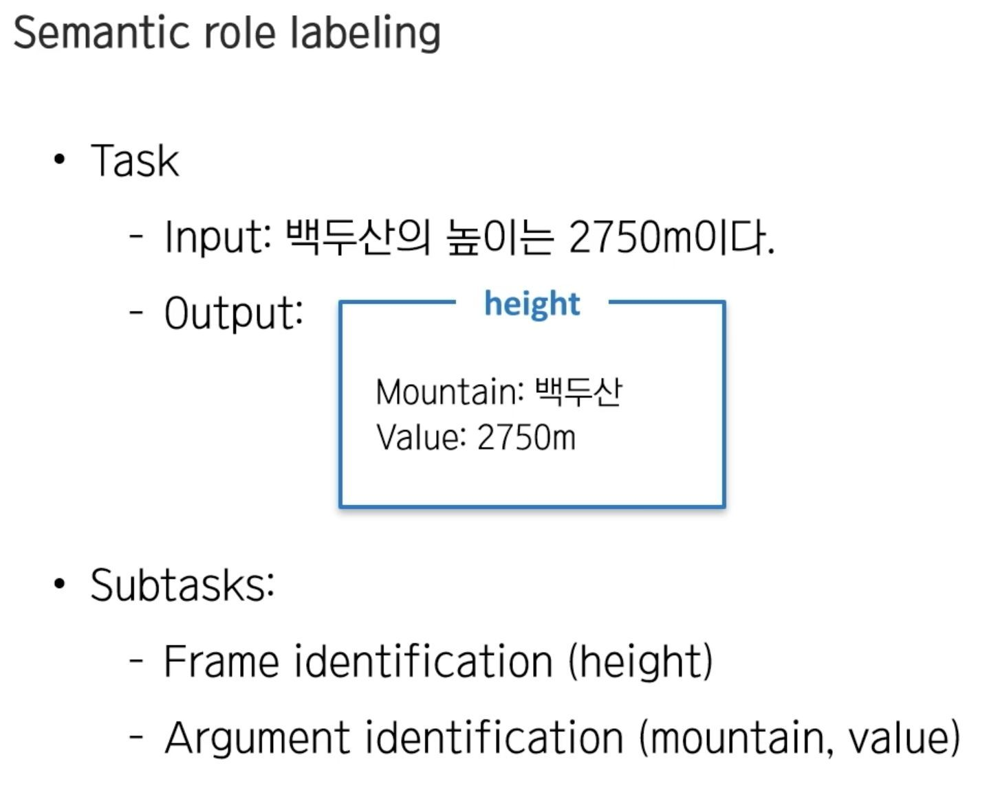  

semantic role labeling을 사용하는데, 문장에 나오는 어떤 대상의 entity와 값이 있을 때, 그 값이 어떤 관계를 갖는 지를 labeling한다. 위에서는 height가 백두산과 2750m를 이어주는 의미를 갖는다. 만약 ‘가장 ~한’, ‘~보다 더’와 같이 합성성을 지닌 문장의 경우에는 Formal semantics를 사용한다. 

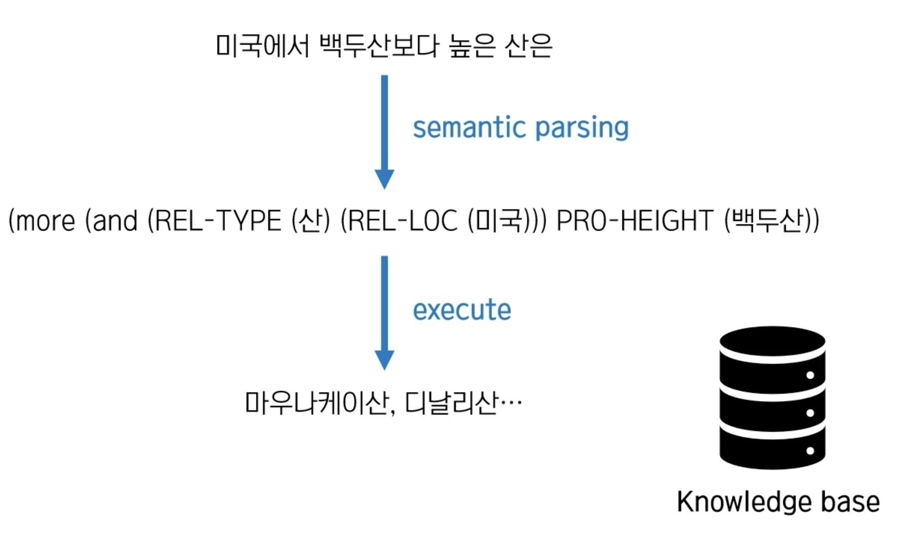  

KB를 통해 문장을 semantic parsing하고, 조건에 부합하는 답을 찾는다.

  

semantic parsing은 세 단계로 진행되는데, 첫 번째는 객체명 인식이다. 두 번째는 DCS를 활용하여 chart parsing, formal query language의 후보군을 만든다. DCS는 formal한 query를 표현하는 language이다. 세 번째는 DCS 후보군을 입력 받은 후 머신러닝 방법론을 이용해서 Ranking을 메긴다.

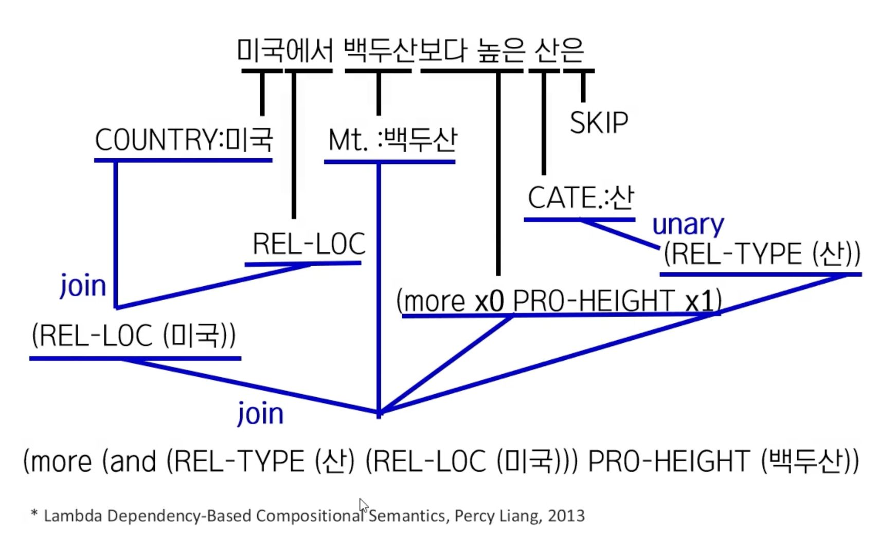  

첫 번째로 각 단어를 사전에 따라 분류한다. 두 번째로 결합이 가능한 타입끼리 결합한다. 위의 그림에서 REL-LOC은 COUNTRY라는 entity타입과 결합할 수 있다는 결합 규칙이 존재해서 join을 하였다. ‘unary’는 표현 자체가 category에 해당한다는 의미이다 REL-TYPE(산)일 경우 그 카테고리 이름이 산이라는 뜻이다. 다만, ‘에서’가 REL-ROC이 아닐 수도 있다. ‘백두산’이 영화 분류일 수도 있다. ‘보다 높은'이 높이(PRO=HEIGHT 말고 다르게 쓰일 수도 있다. 이렇듯 chart parsing을 통해서 formal 표현( “ (more(and (REL-TYPE .... ) “ ) 을 여러 개 만들 수 있는데, 이 중에서 가장 적합한 것을 찾는 것이 ‘Ranking’ 과정에서 이루어진다.

  

  

* * *

  

  

  

  

  

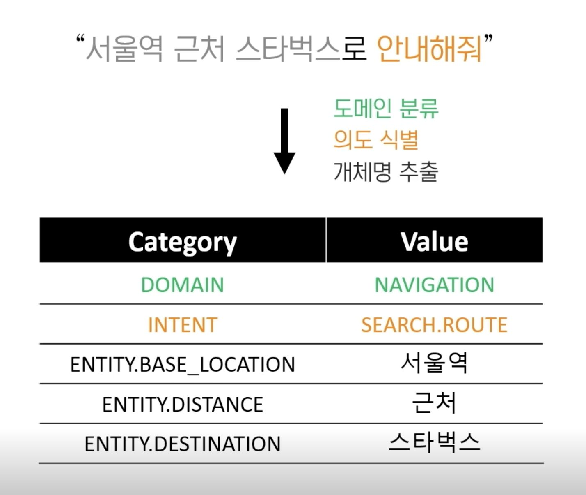  

  

### 도메인 분류

NUGU의 서비스 도메인 확장

  

  

  

도메인은 결국 분류의 문제.

  

  

입력된 문장을 분류하기 위해서 feature을 정리.

  

1\. BOW

원래 있던 문장에서 가방안의 단어 뭉치로 치환. → 정보 손실 발생: 순서 정보가 날라간 단어의 집합이 됨.  

단어의 빈도수 체크

  

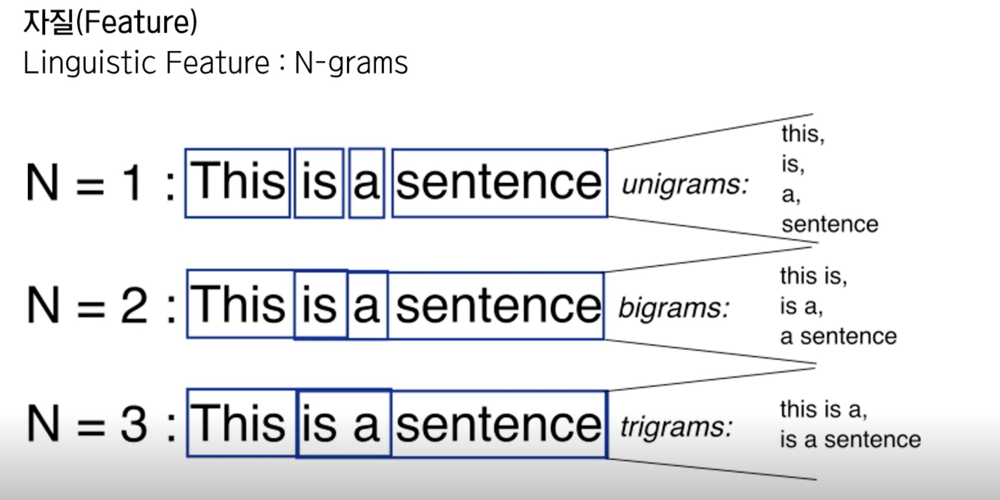  

2\. N-grams

선우 관계(순서 정보)손실을 막는 방법. 

  

unigram : 단일 단어

bigram : 두 연속 단어

trigram : 세 연속 단어

  

  

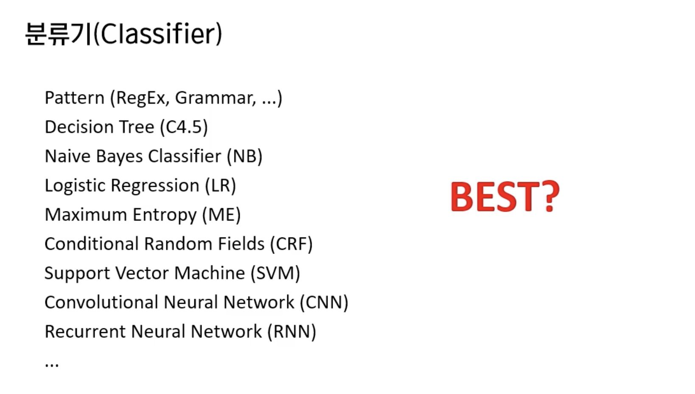  

가장 적합한 분류기 선택

→ 성능, 속도, 오분석 고치기 (딥러닝을 포함한 기계학습 모델은 오분석 고치기가 힘들다. 올바른 데이터를 더 집어넣어서 학습시켜야 함. 반대로 규칙기반은 수정에 용이)

  

### 개체명 인식

  

  

  

첫 번째로 사전의 관점

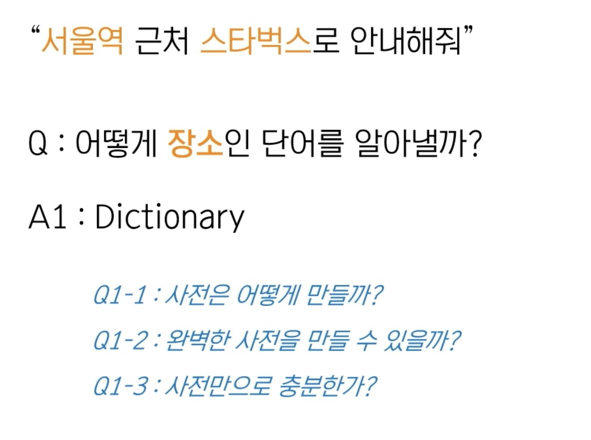  

사전은 기존 사전 db를 가지고 있는 업체와 계약. → 정제 작업도 필요.

사전만으로는 충분하지 않다. 아직 정의되지 않은 단어도 있다.

  

  

두 번째로 Distributional semantics의 관점

  

Q2-2 : 문장이 아니라, 노래제목만 덩그러니 들어오는 경우. 

  

  

  

  

  

개체명을 찾는 방법 : 문장에서 해당 entity를 표시해주는 tag를 붙임.

BIO Tagging

B: 시작단어

I : B-tag 다음에 오는 단어

O : entity에 해당하지 않음.

  

  

  

### 의도 식별

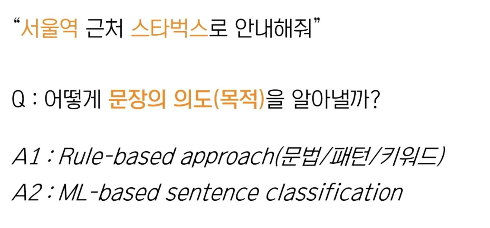  

문장에 드러나는 패턴을 분석해서 규칙으로 품.  

  

  

  

  

  

1. 개체명이 의도 식별에 도움이 된다.
2. 조사나 어미에 의해 다양하게 표현이 되는 경우가 있다. 

  

  

### 도메인 NLU 모델 설계

  

1. A안 : 전부다 intent로 표현
2. B안 : entity로 기기를 잡음
3. C안 : 각 기기를 entity에서도 표현

  

B안이 좀 더 General하게 쓰기 좋아 보인다.

  

  

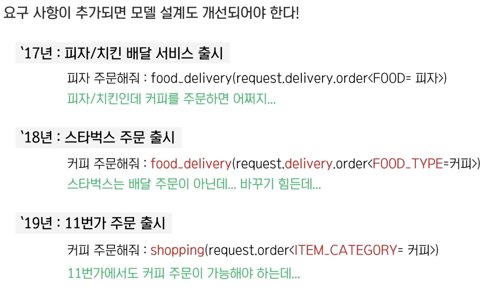  

처음에 받은 요구에만 딱 맞게 모델링하기 보다는, 향후 어떤 요청이 들어올지 고민을 하면서 모델링을 해야 한다.